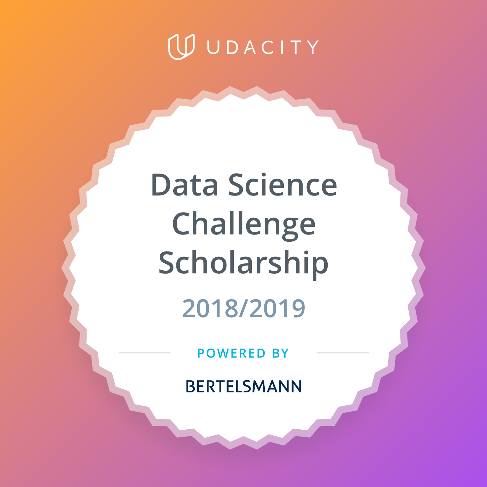

# BUDS-Challenge

## About

This repo contains my personal work, my group-based collaboration, and additional materials for the [Bertlesmann-Udacity Data Science(BUDS) Scholarship](https://www.udacity.com/bertelsmann-data-scholarships) challenge course in [Udacity](https://www.udacity.com) that I have taken.

The [**BUDS** challenge course](https://www.udacity.com/courses/ud002-bert) consists of several individual course and a final group project.

* [Intro to Descriptive Statistics](https://www.udacity.com/course/intro-to-descriptive-statistics--ud827)
* [Introduction for Python Programming](https://www.udacity.com/course/introduction-to-python--ud1110)
* [SQL for Data Analyst](https://www.udacity.com/course/sql-for-data-analysis--ud198)
* Final group project

**NOTE :** Members of the group are encourage to fork, making contributions, submitting pull request (PR), and becoming a join maintainer of this repository.

## Group Project

Short description of the project ...... 

### Members  

| Name | slack_id | udacity_id | github_id | 
|---|--- | --- | --- |
|Blanca Altés|Blanca|  |  |
|Francesco Caberlin|fracab87| | |
|Georgia Martha Sari|geomars|gmarthas|geomars|
| | | | |
| | | | |
| | | | |
| | | | |
| | | | |
| | | | |